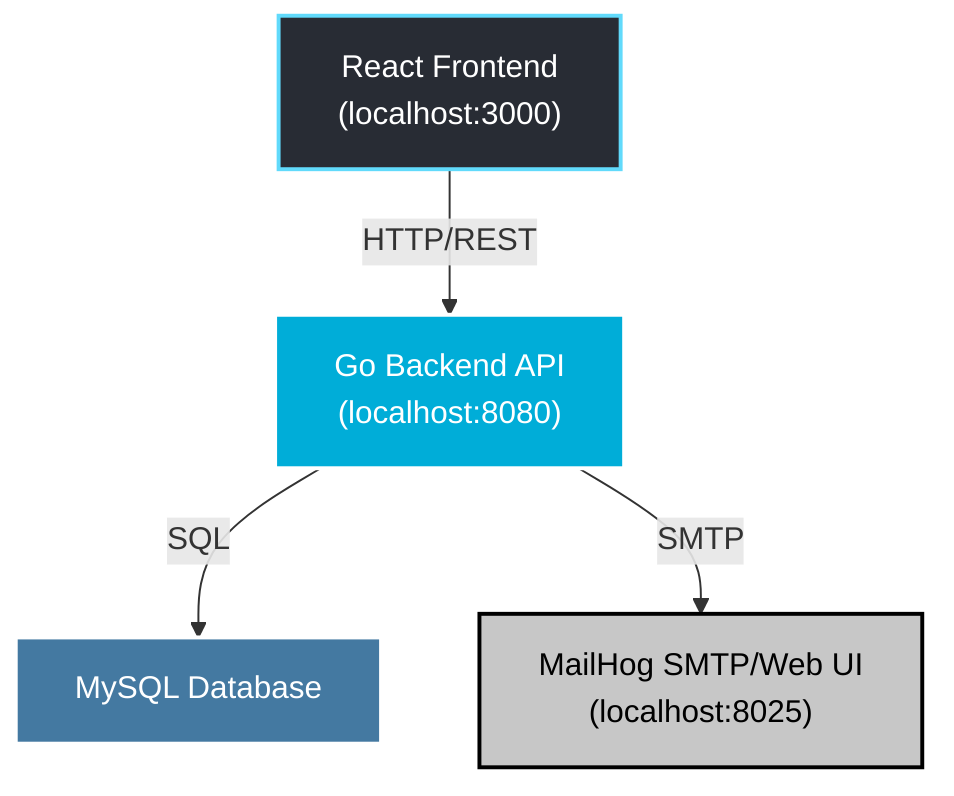

# Secure Communication LTD

A secure web application designed to demonstrate and contrast secure coding practices. The frontend is built with React, Vite, and served by Nginx, while the backend is a Go/Echo API connected to a MySQL database. For development, MailHog is used to capture and display emails. A separate, intentionally vulnerable version will be created later for educational comparison.

## System Architecture



## Project Overview

- **User Registration:** New users can register, triggering an email verification process.
- **Secure Login:** Mandatory Two-Factor Authentication (2FA) via Email OTP. OTPs are single-use, 6-digit codes with a ~10-minute expiry, are invalidated after use, and have throttled submission attempts.
- **Password Policy:** Enforced via a TOML configuration file, defining minimum length, complexity requirements, and account lockout policies.
- **Customer Management:** Secure CRUD operations for customer data (implemented with prepared statements to prevent SQLi).
- **Password Recovery:** A secure forgot/reset password flow using hashed tokens delivered via email (captured by MailHog in development).

## Security Controls

| Control                | Implementation                               | Notes                                                                                                                                        |
| :--------------------- | :------------------------------------------- | :------------------------------------------------------------------------------------------------------------------------------------------- |
| **Password storage**   | HMAC-SHA256 + per-user 16-byte salt          | Secret key is managed via the `HMAC_SECRET` environment variable. **Note:** `bcrypt` or `Argon2` is strongly recommended for production environments. |
| **Email verification** | SHA-1 hashed token, single-use, expiry       | Stored in the `email_verification_tokens` table.                                                                                             |
| **2FA (Email OTP)**    | 6-digit code, single-use, ~10 min TTL        | Stored hashed (e.g., SHA-1), with limited attempts. Invalidated on success or expiry.                                                        |
| **SQL Injection**      | Prepared statements via `sqlx`               | All database queries are parameterized to prevent SQLi attacks.                                                                              |
| **Cross-Site Scripting (XSS)** | React escaping; backend returns JSON only    | React automatically escapes data rendered in components. The API exclusively serves JSON, avoiding server-side template injection.         |
| **Rate limiting / lockout** | Enforced by TOML config                      | `max_login_attempts` and `lockout_minutes` are checked before password verification.                                                         |
| **CSRF**               | Not implemented (JSON API + httpOnly cookie) | The API is designed to be stateless where possible. For stateful operations, a robust CSRF strategy would be required in production.          |

## Tech Stack

| Tier                | Technology              | Notes                                                      |
| :------------------ | :---------------------- | :--------------------------------------------------------- |
| **Frontend**        | React, Vite             | UI library and development server.                         |
| **Backend**         | Go (Echo)               | High-performance, extensible Go web framework.             |
| **Database**        | MySQL                   | Relational database for data persistence.                  |
| **Web Server (Prod)** | Nginx                   | Serves the static React build in the production container. |
| **Mail (Dev)**      | MailHog                 | Captures development emails for viewing (UI: 8025, SMTP: 1025). |
| **Containerization**  | Docker, Docker Compose  | For building and running the application stack.            |

## Prerequisites

- Go 1.24+
- Node.js 18+
- Docker 20.10+ & Docker Compose v2
- Git

## Folder Structure

```
secure-Comunication_LTD/
├── backend/
│   ├── cmd/main.go
│   ├── config/
│   │   ├── .env.example
│   │   ├── password-policy.toml
│   │   └── policy.go
│   ├── db/init.sql
│   ├── internal/
│   │   ├── handlers/
│   │   │   ├── auth.go          # register + email verification link
│   │   │   ├── login.go         # step 1: password + start OTP
│   │   │   ├── login_mfa.go     # step 2: verify OTP
│   │   │   ├── logout.go
│   │   │   ├── me.go
│   │   │   └── verify.go        # email verification landing
│   │   ├── middleware/auth.go
│   │   ├── repository/db.go
│   │   └── services/
│   │       ├── jwt.go
│   │       ├── mailer.go
│   │       ├── password.go
│   │       └── token.go
│   ├── Dockerfile
│   ├── go.mod
│   ├── go.sum
│   └── README.md
├── frontend/
│   ├── public/vite.svg
│   ├── src/
│   │   ├── assets/react.svg
│   │   ├── lib/api.js
│   │   ├── pages/
│   │   │   ├── Register.jsx
│   │   │   ├── Login.jsx
│   │   │   ├── Forgot.jsx
│   │   │   ├── Reset.jsx
│   │   │   └── Dashboard.jsx
│   │   ├── App.css
│   │   ├── App.jsx
│   │   ├── index.css
│   │   └── main.jsx
│   ├── .env.example
│   ├── Dockerfile
│   ├── nginx.conf
│   ├── package.json
│   └── vite.config.js
├── docker-compose.yml
├── LICENSE
└── README.md
```

## Environment Variables

You must create `.env` files for both the backend and frontend services.

### Backend

Copy the example file from the repository root:
```sh
cp backend/config/.env.example backend/.env
```

Update the `backend/.env` file with the following variables:
- `PORT`: Port for the backend API (e.g., `8080`).
- `DB_HOST`: Database service name (e.g., `db`).
- `DB_PORT`: Database port (e.g., `3306`).
- `DB_USER`: Database user (e.g., `user`).
- `DB_PASS`: Database password (e.g., `password`).
- `DB_NAME`: Database name (e.g., `app_db`).
- `HMAC_SECRET`: A long, random string for signing tokens and hashing passwords.
- `JWT_SECRET`: A long, random string for JWT signing.
- `SMTP_HOST`: MailHog service name (e.g., `mailhog`).
- `SMTP_PORT`: MailHog SMTP port (e.g., `1025`).
- `SMTP_FROM`: Default "from" address for emails (e.g., `no-reply@secure.com`).
- `PASSWORD_POLICY_FILE`: Path to the password policy config (default: `config/password-policy.toml`).
- `BACKEND_PUBLIC_URL`: Publicly accessible URL for the backend, used for email links (e.g., `http://localhost:8080`).

### Frontend

Copy the example file from the repository root:
```sh
cp frontend/.env.example frontend/.env
```

Update the `frontend/.env` file with the following variable:
- `VITE_API_URL`: The full URL to the backend API (e.g., `http://localhost:8080`).

## Setup & Run

The entire application stack can be launched using Docker Compose.

From the repository root, run:
```sh
docker compose up -d --build
```

### Access Points

| Service             | URL                                                    |
| :------------------ | :----------------------------------------------------- |
| **Frontend (Nginx)**  | http://localhost:3000                                  |
| **Backend (Echo)**    | http://localhost:8080                                  |
| **MailHog UI**        | http://localhost:8025                                  |
| **MailHog SMTP**      | `smtp://localhost:1025`                                |
| **MySQL (host)**      | `127.0.0.1:3306` (service name `db` inside compose) |

## Database Notes

The `backend/db/init.sql` script runs automatically when the `db` service starts for the first time. It creates the necessary tables.

To completely reset the database for development:
```sh
docker compose down -v
docker compose up -d --build
```
This command removes the persistent volume associated with the database, allowing `init.sql` to run again on next startup.

**Tables:**
- `users`: Stores user account information.
- `password_history`: Keeps a record of previous passwords to prevent reuse.
- `password_reset_tokens`: Stores tokens for the password reset flow.
- `email_verification_tokens`: Stores tokens for initial email verification.
- `login_attempts`: Tracks failed login attempts for lockout purposes.
- `login_otp_codes`: Stores the single-use OTP codes for 2FA.
- `customers`: Stores customer data managed by users.

## API Surface

All endpoints are prefixed with `/api`.

- `POST /api/register`: Registers a new user and sends a verification link via email.
- `GET /api/verify-email?token=...`: Verifies a user's email address and shows a confirmation page.
- `POST /api/login`: The first step of authentication. Validates the password and, on success, sends an OTP to the user's email. Returns `{ mfa_required: true, method: "email_otp", expires_in: 10 }`.
- `POST /api/login/mfa`: The second step of authentication. Verifies the OTP. On success, it sets a session cookie.
- `POST /api/logout`: Clears the session cookie, logging the user out.
- `GET /api/me`: Returns the currently authenticated user's details. Requires a valid session cookie.
- `POST /api/password/forgot`: Initiates the password reset process by sending a reset link to the user's email (captured by MailHog).
- `POST /api/password/reset`: Completes the password reset process using the token from the reset link.

**Session Cookie Properties (Development):**
- `HttpOnly`: Prevents access from client-side scripts.
- `SameSite=Strict`: Restricts cookie sending to same-site requests. `Lax` may be used if needed.
- `Secure=false`: Set to `false` for local HTTP development. This **must** be `true` in production behind HTTPS.

## Usage Walkthrough

1.  Navigate to `http://localhost:3000/register`.
2.  Fill out the registration form and submit.
3.  Open the MailHog UI at `http://localhost:8025` to find the verification email.
4.  Click the verification link in the email. You will be redirected to a confirmation page.
5.  Go to `http://localhost:3000/login` and enter your credentials.
6.  Check MailHog again for the 2FA email containing the OTP.
7.  Enter the OTP on the login page. On success, you will be redirected to the dashboard.
8.  If you are already logged in, visiting the root URL (`/`) will automatically redirect you to `/dashboard`.
9.  To test the password reset flow, use the "Forgot Password" link on the login page, check MailHog for the email, and follow the link to reset your password.

## Development Notes & Limitations

- **Mandatory 2FA:** Two-factor authentication (Email OTP) is enabled by default and required for all users.
- **OTP Security:** OTP codes are single-use, expire after approximately 10 minutes, and have rate-limited verification attempts to prevent brute-forcing.
- **Account Lockout:** The login lockout policy (`max_login_attempts`, `lockout_minutes`) is defined in `backend/config/password-policy.toml`.
- **CSRF:** CSRF protection is not implemented, as the application follows a JSON API pattern where session state is managed by a cookie but actions are stateless. For more complex stateful interactions, a CSRF strategy (e.g., double-submit cookie) would be necessary.
- **Production Readiness:** This project is for demonstration purposes. For a production environment, you should:
    - Use `bcrypt` or `Argon2` for password hashing instead of HMAC-SHA256.
    - Enforce HTTPS and set the `Secure` flag on cookies.
    - Use a real SMTP provider instead of MailHog.
    - Implement a robust CSRF protection strategy if the application's needs evolve.

## License

This project is licensed under the MIT License. See the [LICENSE](LICENSE) file for details.

## Authors
- Eliran 'https://github.com/EliranMalka1'
