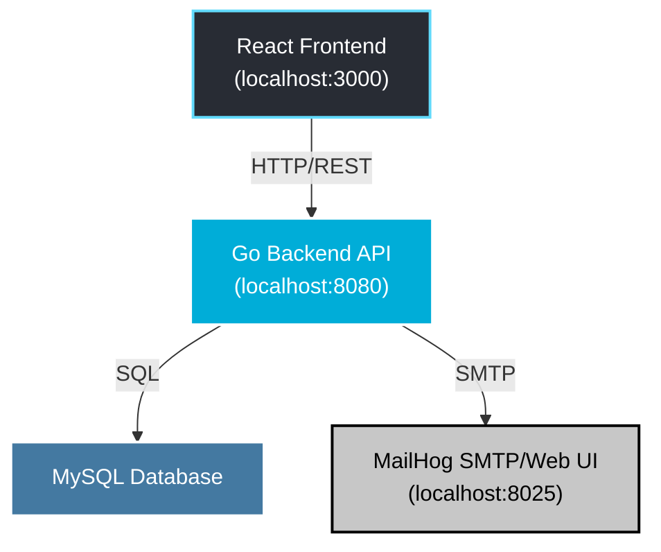

# Secure Communication LTD

## System Architecture Diagram



# Communication_LTD (Secure Version)

## Project Overview

Welcome to **Communication_LTD (Secure Version)**, a web application developed as a final project for a cybersecurity course. This application provides a platform for managing users and customers, with a strong emphasis on security best practices. This is the secure version; a deliberately vulnerable version will be implemented later for comparison.

The core functionalities of the system include:
-   **User Management**: Secure registration and login functionalities.
-   **Password Policy**: Enforces strong password creation and management rules.
-   **Customer Management**: Basic CRUD operations for managing customer data.
-   **Forgot/Reset Password**: A secure flow for users to recover their accounts.

This version of the project has been specifically hardened against common web vulnerabilities, serving as a practical example of securing a modern web application.

---

## Security Features Implemented

This project incorporates several security measures to protect user data and prevent attacks:

| Feature | Implementation | Protection Against |
| :--- | :--- | :--- |
| **Password Hashing** | HMAC+SHA256 with a unique Salt for each user. | Rainbow table attacks, dictionary attacks. |
| **Reset Token Hashing** | SHA-1 for generating password reset tokens. | Token guessing. |
| **Password Policy** | - Minimum length (e.g., 12 characters).<br>- Complexity (uppercase, lowercase, numbers, symbols).<br>- Password history to prevent reuse.<br>- Account lockout after multiple failed login attempts. | Brute-force attacks, weak passwords. |
| **SQL Injection (SQLi)** | Use of prepared statements in all database queries. | Injection of malicious SQL code. |
| **Cross-Site Scripting (XSS)** | - **Backend**: Strict output encoding on all data rendered in templates.<br>- **Frontend**: React's inherent data binding and JSX escaping. | Injection of malicious scripts into the web application. |
| **Cross-Site Request Forgery (CSRF)** | Not Implemented | Unauthorized commands being performed on behalf of an authenticated user. |
| **Rate Limiting** | Partially Implemented. Tracks login attempts, but lockout logic is not yet enforced. | Brute-force attacks, denial-of-service (DoS). |

---

## Tech Stack

| Component | Technology | Description |
| :--- | :--- | :--- |
| **Frontend** | [React](https://reactjs.org/) (with Node.js) | A JavaScript library for building user interfaces. |
| **Frontend Build** | Vite + React (with Nginx serving static files in Docker) | A JavaScript library for building user interfaces. |
| **Backend** | [Go](https://golang.org/) with [Echo Framework](https://echo.labstack.com/) | A high-performance, minimalist Go web framework. |
| **Backend Mail** | MailHog for development SMTP. | An email testing tool for developers (for Forgot Password flow). |
| **Database** | [MySQL](https://www.mysql.com/) | A popular open-source relational database. |
| **Mail Server** | [MailHog](https://github.com/mailhog/MailHog) | An email testing tool for developers (for Forgot Password flow). |
| **Containerization** | [Docker](https://www.docker.com/) & [Docker Compose](https://docs.docker.com/compose/) | For creating and managing isolated application environments. |

---

## Prerequisites / Requirements

Before you begin, ensure you have the following tools installed on your system:

-   **Go**: Version 1.24 or higher
-   **Node.js**: Version 18 or higher (with `npm` or `yarn`)
-   **Docker**: Version 20.10 or higher
-   **Docker Compose**: Version 2.x
-   **Git**: For cloning the repository
-   **Optional**: `golang-migrate` for database migrations if you prefer to run them outside of Docker.

---

## Folder Structure

The actual directory layout for this project is:

```
secure-Comunication_LTD/
├── backend/                  # Go backend application
│   ├── cmd/
│   │   └── main.go
│   ├── config/
│   │   ├── .env.example
│   │   ├── password-policy.toml
│   │   └── policy.go
│   ├── db/
│   │   └── init.sql
│   ├── internal/
│   │   ├── handlers/
│   │   │   ├── auth.go (includes registration)
│   │   │   ├── login.go
│   │   │   ├── logout.go
│   │   │   ├── me.go
│   │   │   └── verify.go (for email verification)
│   │   ├── middleware/
│   │   │   └── auth.go
│   │   ├── repository/
│   │   │   └── db.go
│   │   └── services/
│   │       ├── jwt.go
│   │       ├── mailer.go
│   │       ├── password.go
│   │       └── token.go
│   ├── .dockerignore
│   ├── .env
│   ├── Dockerfile
│   ├── go.mod
│   ├── go.sum
│   └── README.md
├── config/                   # Global configuration files (currently empty)
├── frontend/                 # React frontend application
│   ├── public/
│   │   └── vite.svg
│   ├── src/
│   │   ├── assets/
│   │   │   └── react.svg
│   │   ├── lib/
│   │   │   └── api.js
│   │   ├── pages/
│   │   │   ├── Login.jsx
│   │   │   └── Register.jsx
│   │   ├── App.css
│   │   ├── App.jsx
│   │   ├── index.css
│   │   └── main.jsx
│   ├── .dockerignore
│   ├── .env
│   ├── .env.example
│   ├── .gitignore
│   ├── Dockerfile
│   ├── README.md
│   ├── eslint.config.js
│   ├── index.html
│   ├── nginx.conf
│   ├── node_modules/
│   ├── package-lock.json
│   ├── package.json
│   └── vite.config.js
├── docker-compose.yml        # Docker Compose configuration
├── LICENSE                   # Project license
├── README.md                 # Project documentation
```

---

## Setup Instructions

1.  **Clone the Repository**
    ```bash
    git clone https://github.com/EliranMalka1/secure-Comunication_LTD.git
    cd secure-Comunication_LTD
    ```

2.  **Configure Environment Variables**
    Copy the example environment file and customize it with your local settings.
    ```bash
    cp backend/.env.example backend/.env
    ```
    And
    ```bash
    cp frontend/.env.example frontend/.env
    ```
    *Fill in the required values in the `.env` file as described in the Environment Variables section.*

4.  **Build and Run Containers**
    Use Docker Compose to build the images and start all services in detached mode.
    ```bash
    docker compose up -d --build
    ```
---

## Access Points

Once the services are running, you can access them at the following locations:

| Service | URL / Host | Port |
| :--- | :--- | :--- |
| **React Frontend** | `http://localhost:3000` | `3000` |
| **Go Backend API** | `http://localhost:8080` | `8080` |
| **MailHog Web UI** | `http://localhost:8025` | `8025` |
| **MySQL Database** | `localhost` (from host) / `db` (from Docker network) | `3306` |

---

## Environment Variables

The `.env` file is crucial for configuring the application backend.

| Variable | Description | Example |
| :--- | :--- | :--- |
| `PORT` | Port for the Go backend API. | `8080` |
| `DB_HOST` | Database host name (service name in Docker Compose is usually `db`). | `db` |
| `DB_PORT` | Database port. | `3306` |
| `DB_USER` | Database username. | `app` |
| `DB_PASS` | Database password. | `secret` |
| `DB_NAME` | Database name. | `secure_comm` |
| `HMAC_SECRET` | Secret key for HMAC (used for password hashing with SHA256). | `change_me_hmac` |
| `JWT_SECRET` | Secret key for signing JWTs. | `change_me_jwt` |
| `SMTP_HOST` | SMTP server host (MailHog for dev, e.g. `mailhog` or `localhost`). | `localhost` |
| `SMTP_PORT` | SMTP server port. | `1025` |
| `SMTP_FROM` | Default sender email address. | `no-reply@communication_ltd.local` |
| `PASSWORD_POLICY_FILE` | Path to password policy TOML file. | `config/password-policy.toml` |


And frontend:

| Variable | Description | Example |
| :--- | :--- | :--- |
| `VITE_API_URL` | The backend api URL. | `http://localhost:8080` |

---

## Usage Examples

1.  **Register a new user**: Navigate to `http://localhost:3000/register` and fill out the form.
2.  **Email Verification**: After registration, check MailHog for a verification link before logging in.
3.  **Login**: Go to `http://localhost:3000/login` and enter your credentials.
4.  **Change Password**: Once logged in, go to your profile page to change your password.
5.  **Reset Password**: On the login page, click "Forgot Password", enter your email, and follow the instructions sent to your inbox (viewable in the MailHog UI at `http://localhost:8025`).

---

## Notes for Development

-   **MailHog**: The included MailHog service is for **development and testing only**. It captures all outgoing emails for easy inspection without sending them to actual recipients. For production, you would replace this with a real SMTP service like SendGrid or Amazon SES.
-   **Password Hashing**: HMAC+SHA256 with salt is used here for educational purposes to demonstrate the principles of hashing and salting. In a **production environment**, it is strongly recommended to use a more robust and battle-tested adaptive hashing algorithm like **bcrypt** or **Argon2**.

---

## License

This project is licensed under the MIT License. See the `LICENSE` file for details.

## Authors

- [Eliran Malka](https://github.com/EliranMalka1)