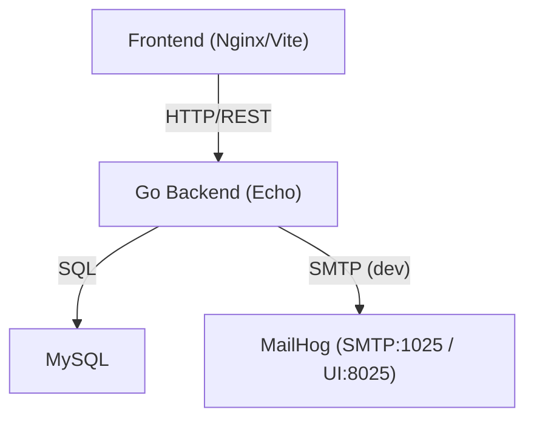

# Backend (Secure Version) – Communication_LTD

This backend provides a secure REST API for the "Secure Communication LTD" project. It is built with Go and the Echo framework, featuring a MySQL database for data persistence. Key security features include mandatory email verification after registration, a two-factor authentication (2FA) flow using email-based One-Time Passwords (OTPs), and secure cookie-based session management. For development, MailHog is used to capture and display outgoing emails.

## Requirements / Prerequisites

- Go 1.24+
- MySQL 8+
- Git
- Docker 20.10+ (optional)
- Docker Compose v2 (optional)

*Note that Node.js is not required for the backend.*

## Tech Stack

- **Go + Echo**: Core language and web framework.
- **MySQL**: Database using `go-sql-driver/mysql` and `sqlx`.
- **Configuration**: `godotenv` for environment variables and a TOML loader for security policies.
- **Dev Mail**: MailHog for local SMTP testing.

## Folder Structure

```
backend/
├── cmd/
│   └── main.go
├── config/
│   ├── .env.example
│   ├── password-policy.toml
│   └── policy.go
├── db/
│   └── init.sql
├── internal/
│   ├── handlers/
│   │   ├── auth.go           # register + send verification email
│   │   ├── login.go          # step 1: password + start OTP
│   │   ├── login_mfa.go      # step 2: verify OTP
│   │   ├── logout.go
│   │   ├── me.go
│   │   └── verify.go         # email verification landing
│   ├── middleware/
│   │   └── auth.go
│   ├── repository/
│   │   └── db.go
│   └── services/
│       ├── jwt.go
│       ├── mailer.go
│       ├── password.go
│       └── token.go
├── .dockerignore
├── .env
├── Dockerfile
├── go.mod
├── go.sum
└── README.md
```

## Configuration

### Environment Variables

Create a `.env` file by copying the example:

```sh
cp backend/config/.env.example backend/.env
```

Update the `backend/.env` file with your settings.

- `PORT`: API port (default `8080`).
- `DB_HOST`: Database host.
- `DB_PORT`: Database port.
- `DB_USER`: Database username.
- `DB_PASS`: Database password.
- `DB_NAME`: Database name.
- `HMAC_SECRET`: Secret used by HMAC-SHA256 for password hashing.
- `JWT_SECRET`: Secret for signing JWTs used in the auth cookie.
- `SMTP_HOST`: Development SMTP host (MailHog).
- `SMTP_PORT`: Development SMTP port (MailHog).
- `SMTP_FROM`: Default "from" address for emails.
- `PASSWORD_POLICY_FILE`: Path to the password policy TOML file (default `config/password-policy.toml`).
- `BACKEND_PUBLIC_URL`: Base URL used in emails (e.g., `http://localhost:8080`).
- `FRONTEND_ORIGIN`: (Optional) Configures the `Access-Control-Allow-Origin` header for production.

### Password Policy (TOML)

The password policy is defined in `config/password-policy.toml`.

```toml
min_length = 10
complexity_rules = ["has_upper", "has_lower", "has_digit", "has_special"]
history = 3              # planned (not enforced yet)
max_login_attempts = 3
lockout_minutes = 15
```

**Enforcement Status:**
- **Enforced**: Minimum length, complexity rules, and account lockout (`max_login_attempts`, `lockout_minutes`).
- **Not Enforced**: Password history is planned but not yet implemented.

## Database

The database schema is defined in `backend/db/init.sql` and is applied automatically when the database container starts for the first time.

To reset the database completely during development:

```sh
docker compose down -v
docker compose up -d --build
```

### Tables

- `users`: Stores user profiles, including `is_verified` status.
- `password_history`: For future use to track password changes.
- `password_reset_tokens`: Stores tokens for the password reset flow.
- `email_verification_tokens`: Stores tokens for the initial email verification.
- `login_attempts`: Tracks failed login attempts for account lockout.
- `login_otp_codes`: Stores single-use 6-digit OTPs with an expiry for 2FA.
- `customers`: Stores customer data (to be developed).

## API Endpoints (current)

### Auth & Session

- `POST /api/register`
  - **Body**: `{ "username": "...", "email": "...", "password": "..." }`
  - **Action**: Creates a new user (unverified) and sends a verification link to their email.

- `GET /api/verify-email?token=...`
  - **Action**: Verifies the user's email address and returns an HTML confirmation page.

- `POST /api/login` (Step 1)
  - **Body**: `{ "id": "user@example.com", "password": "..." }`
  - **Action**: On success, returns `{ "mfa_required": true, "method": "email_otp", "expires_in": 10 }` and sends an OTP to the user's email.

- `POST /api/login/mfa` (Step 2)
  - **Body**: `{ "id": "user@example.com", "code": "123456" }`
  - **Action**: Verifies the OTP. On success, sets a secure `httpOnly` cookie with a JWT and returns `{ "message": "ok" }`.

- `POST /api/logout`
  - **Action**: Clears the authentication cookie, ending the session.

- `GET /api/me`
  - **Action**: Returns the current authenticated user's details if a valid session cookie is present.

### Password Management

- `POST /api/password/forgot`
  - **Action**: Sends a password reset link to the user's email (captured by MailHog in dev).

- `POST /api/password/reset`
  - **Action**: Resets the user's password using a valid token from the reset link.

*(Customer routes will be added securely in a future update.)*

## Sessions & Cookies

Session state is managed via a signed JWT stored in a cookie, which is set upon successful 2FA verification (`/api/login/mfa`).

- **Cookie Flags (dev)**: `HttpOnly`, `SameSite=Strict` (or `Lax` where needed), `Secure=false`. In production, `Secure` should be set to `true` when operating behind an HTTPS proxy.
- **Logout**: The cookie is immediately expired and cleared on logout.

## CORS

- **Development**: CORS is configured to allow requests from `http://localhost:5173` (Vite) and `http://localhost:3000` (Nginx).
- **Production**: Set the `FRONTEND_ORIGIN` environment variable to a single trusted origin to configure CORS appropriately.

## Security Features (current state)

| Control             | Implementation                               | Status                |
| ------------------- | -------------------------------------------- | --------------------- |
| Password hashing    | HMAC-SHA256 + per-user 16-byte salt          | Implemented           |
| Email verification  | SHA-1 hashed token, single-use, expiry       | Implemented           |
| 2FA (Email OTP)     | 6-digit OTP, single-use, ~10-min TTL         | Implemented (default ON)|
| SQL Injection       | Prepared statements via `sqlx`               | Implemented           |
| XSS                 | JSON-only API; React escapes output          | Implemented           |
| Lockout             | `max_login_attempts` + `lockout_minutes`     | Implemented           |
| Password history    | Prevent reuse of last N passwords            | Planned (not enforced)|

**Note**: In a production environment, it is strongly recommended to replace HMAC with a more robust password hashing algorithm like **bcrypt** or **Argon2**.

## Running the Backend

### With Docker

```sh
# Build the image
docker build -t backend-secure ./backend

# Run the container
docker run -p 8080:8080 --env-file ./backend/.env backend-secure
```

### With Docker Compose

```sh
# Start the backend service and its dependencies
docker compose up -d backend
```

### Direct (local)

```sh
# Run the main application
go run cmd/main.go
```

## Quick Test (Dev)

1.  **Register**: `POST` to `/api/register`. Open MailHog (`http://localhost:8025`) and click the verification link in the email.
2.  **Login (Step 1)**: `POST` to `/api/login`. Check for a success response indicating MFA is required.
3.  **Login (Step 2)**: Get the OTP from the new email in MailHog and `POST` it to `/api/login/mfa`. A session cookie will be set in your client.
4.  **Verify Session**: `GET` `/api/me` to see your user details. `POST` `/api/logout` to clear the session.
5.  **Password Reset**: Optionally, trigger the `/api/password/forgot` and `/api/password/reset` flow and observe the emails in MailHog.

## Architecture Diagram



## Notes

- Email verification is required before a user can log in.
- 2FA via email OTP is enabled by default for all users.
- MailHog is for development purposes only. Configure a real SMTP service for production.
- Replacing HMAC with bcrypt or Argon2 is recommended for production-grade password storage.

## License / Author

- **MIT License**
- **Author**: Eliran Malka 