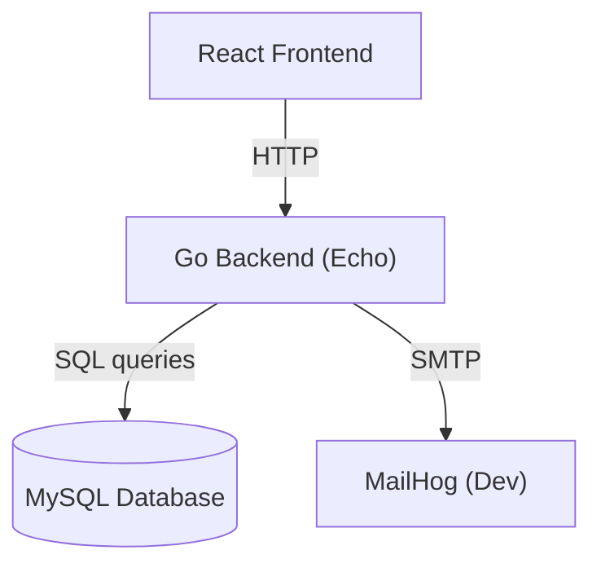

# Backend (Secure Version) - Communication_LTD

## Project Overview
This backend provides a **secure API** for user management, authentication, password policy enforcement, customer management, and password reset via email.  
The secure version focuses on implementing security best practices to protect user data and ensure a robust and reliable system.

---

## Requirements / Prerequisites
To run this backend, you will need:

- **Go:** v1.24+  
- **MySQL:** v8+  
- **Git**  
- **Docker** v20.10+ (optional)  
- **Docker Compose v2** (optional)  

Node.js is **not required** for the backend (only for the frontend).

---

## Tech Stack
- **Backend:** Go with [Echo](https://echo.labstack.com/)  
- **Database Driver:** [go-sql-driver/mysql](https://github.com/go-sql-driver/mysql) + [sqlx](https://github.com/jmoiron/sqlx)  
- **Configuration:** [godotenv](https://github.com/joho/godotenv)  
- **Mail (Dev):** [MailHog](https://github.com/mailhog/MailHog)  

---

## Folder Structure
```
backend/
├── cmd/                 # Application entry point
│   └── main.go
├── internal/            # Core logic
│   ├── handlers/        # HTTP route handlers
│   ├── services/        # Business logic
│   └── repository/      # Database access
├── config/
│   ├── password-policy.toml
│   └── .env.example
├── db/
│   └── init.sql         # Schema + seed data (executed once on DB init)
├── go.mod
├── go.sum
└── README.md
```

---

## Configuration

### Environment Variables
Copy `.env.example` to `.env` and update values:

```bash
cp config/.env.example /.env
```

Required variables:

- `DB_HOST`  
- `DB_PORT`  
- `DB_USER`  
- `DB_PASS`  
- `DB_NAME`  
- `HMAC_SECRET`  
- `JWT_SECRET`  
- `SMTP_HOST`  
- `SMTP_PORT`  
- `SMTP_FROM`  

### Password Policy
Defined in `config/password-policy.toml`:

```toml
min_length = 10
complexity_rules = ["has_upper", "has_lower", "has_digit", "has_special"]
history = 3
max_login_attempts = 3
lockout_minutes = 15
```

---

## Database Schema
The schema and seed data are in `db/init.sql`.  
Executed automatically **only on first DB startup**.  

- Reset DB with `docker compose down -v && docker compose up`  
- Or update manually with SQL migrations (`ALTER TABLE`, etc).  

Tables:
- `users`  
- `password_history`  
- `password_reset_tokens`  
- `customers`  
- `login_attempts`  

---

## API Routes (Examples)

### Authentication
- `POST /api/register` – Register user  
- `POST /api/login` – Authenticate & return JWT  

### Password Management
- `POST /api/password/change` – Change password  
- `POST /api/password/forgot` – Send reset link  
- `POST /api/password/reset` – Reset with token  

### Customer Management
- `POST /api/customers` – Create customer  
- `GET /api/customers` – List customers  

---

## Security Features
- Passwords hashed with HMAC + salt  
- Password reset tokens hashed (SHA-1)  
- Strong password policy enforced  
- Prepared statements for SQL queries  
- Escaping outputs to prevent XSS  
- Login throttling (3 attempts, 15 min lockout)  
- Generic error messages  

---

## Running the Backend

### Docker
```bash
docker build -t backend-secure ./backend
docker run -p 8080:8080 --env-file ./backend/config/.env backend-secure
```

### Docker Compose
```bash
docker compose up -d backend
```

### Direct
```bash
go run cmd/main.go
```

---

## Compliance with Requirements
- **User Management:** Implemented  
- **Password Storage:** Secure with HMAC+salt  
- **Password Reset:** Token-based, hashed  
- **Password Policy:** Configurable in TOML  
- **SQL Injection Protection:** Prepared statements  
- **XSS Protection:** Escaped outputs  
- **Login Throttling:** Configurable lockout  

---

## Architecture Diagram



---

## Notes
- **MailHog** is for development/testing only.  
- For production, use a stronger hash (bcrypt/Argon2).  
- Database seed data is for development/testing only.

---

## License / Authors
MIT License  

**Author:** [Eliran Malka](https://github.com/EliranMalka1)
            [Eliran Malka](https://github.com/EliranMalka1)
            [Eliran Malka](https://github.com/EliranMalka1)
            [Eliran Malka](https://github.com/EliranMalka1)
