# Backend (Secure Version) - Communication_LTD

## Project Overview
This backend provides a **secure API** for user management, authentication, password policy enforcement, customer management, and password reset via email.  
The secure version focuses on implementing security best practices to protect user data and ensure a robust and reliable system. The backend now includes an email verification flow after user registration.

---

## Requirements / Prerequisites
To run this backend, you will need:

- **Go:** v1.24+  
- **MySQL:** v8+  
- **Git**  
- **Docker** v20.10+ (optional)  
- **Docker Compose v2** (optional)  

Node.js is **not required** for the backend (only for the frontend).

---

## Tech Stack
- **Backend:** Go with [Echo](https://echo.labstack.com/)  
- **Database Driver:** [go-sql-driver/mysql](https://github.com/go-sql-driver/mysql) + [sqlx](https://github.com/jmoiron/sqlx)  
- **Configuration:** [godotenv](https://github.com/joho/godotenv)  
- **Mail (Dev):** [MailHog](https://github.com/mailhog/MailHog)  

---


## Folder Structure
```
backend/
├── cmd/
│   └── main.go
backend/
├── cmd/
│   └── main.go
├── config/
│   ├── .env.example
│   ├── password-policy.toml
│   └── policy.go
├── db/
│   └── init.sql
├── internal/
│   ├── handlers/
│   │   ├── auth.go
│   │   ├── login.go
│   │   ├── logout.go
│   │   ├── me.go
│   │   └── verify.go
│   ├── middleware/
│   │   └── auth.go
│   ├── repository/
│   │   └── db.go
│   └── services/
│       ├── jwt.go
│       ├── mailer.go
│       ├── password.go
│       └── token.go
├── .dockerignore
├── .env
├── Dockerfile
├── go.mod
├── go.sum
└── README.md
```
├── .env
├── Dockerfile
├── go.mod
├── go.sum
└── README.md
```

---

## Configuration


### Environment Variables
Copy `.env.example` to `.env` and update values:

```bash
cp config/.env.example .env
```

Required variables:

- `PORT`                # API server port
- `DB_HOST`             # MySQL host (service name in Docker Compose)
- `DB_PORT`             # MySQL port
- `DB_USER`             # MySQL user
- `DB_PASS`             # MySQL password
- `DB_NAME`             # MySQL database name
- `HMAC_SECRET`         # HMAC+SHA256 secret for password hashing
- `JWT_SECRET`          # JWT signing secret
- `SMTP_HOST`           # SMTP server host (MailHog for dev)
- `SMTP_PORT`           # SMTP server port
- `SMTP_FROM`           # Default sender email
- `PASSWORD_POLICY_FILE`# Path to password policy TOML file

### Password Policy
Defined in `config/password-policy.toml`:

```toml
min_length = 10
complexity_rules = ["has_upper", "has_lower", "has_digit", "has_special"]
history = 3 # Not yet implemented, planned for a future version.
max_login_attempts = 3
lockout_minutes = 15
```

---

## Database Schema
The schema and seed data are in `db/init.sql`.  
Executed automatically **only on first DB startup**.  

- Reset DB with `docker compose down -v && docker compose up`  
- Or update manually with SQL migrations (`ALTER TABLE`, etc).  

Tables:
- `users`  
- `password_history`  
- `password_reset_tokens`  
- `customers`  
- `login_attempts`  
- `email_verification_tokens`

---

## API Routes (Examples)

### Authentication
- `POST /api/register` – Register user  
- `POST /api/login` – Authenticate & return JWT  
- `POST /api/logout` – Logs out the current user by clearing the cookie.
- `GET /api/me` – Returns current user details based on authentication.
- `GET /api/verify-email` – Verifies a user account via token.


### Password Management
- `POST /api/password/change` – Change password  
- `POST /api/password/forgot` – Send reset link  
- `POST /api/password/reset` – Reset with token  

### Customer Management
- `POST /api/customers` – Create customer  
- `GET /api/customers` – List customers  

---

## Security Features
- **Password Hashing:** Passwords are hashed using HMAC+SHA256 with a per-user salt to protect against rainbow table attacks.
- **Password Reset Tokens:** Tokens are hashed in the database (SHA-1) to prevent takeover if the DB is compromised.
- **Strong Password Policy:** Enforced via a configurable policy (`config/password-policy.toml`).
- **SQL Injection:** Prepared statements are used for all database queries to prevent SQL injection attacks.
- **XSS Protection:** The backend implements minimal escaping. The primary defense against XSS is handled by the React frontend, which automatically escapes content.
- **Login Throttling:** Partial implementation. The system tracks failed login attempts in the `login_attempts` table, but full enforcement of account lockout is still in progress.
- **Generic Error Messages:** The API returns generic error messages to avoid revealing specific user or system details.

---

## Running the Backend

### Docker
```bash
docker build -t backend-secure ./backend
docker run -p 8080:8080 --env-file ./backend/config/.env backend-secure
```

### Docker Compose
```bash
docker compose up -d backend
```

### Direct
```bash
go run cmd/main.go
```

---

## Compliance with Requirements
- **User Management:** Implemented  
- **Password Storage:** Secure with HMAC+salt  
- **Password Reset:** Token-based, hashed  
- **Password Policy:** Configurable in TOML  
- **SQL Injection Protection:** Prepared statements  
- **XSS Protection:** Escaped outputs  
- **Login Throttling:** Configurable lockout  

---

## Architecture Diagram

```mermaid
flowchart TD
    A[React Frontend] -->|HTTP| B["Go Backend (Echo)"];
    B -->|SQL queries| C[(MySQL Database)];
    B -->|SMTP| D["MailHog (Dev)"];
```


**Note:** For development, SMTP is handled by MailHog. For production, a real SMTP provider is required.

---

## Notes
- **Email Verification:** Email verification is required before a user can log in.
- **Production SMTP:** For production, replace MailHog with a real SMTP provider (e.g., AWS SES, SendGrid).
- **MailHog** is for development/testing only.  
- For production, use a stronger hash (bcrypt/Argon2).  
- Database seed data is for development/testing only.

---

## License / Authors
MIT License  

**Author:** [Eliran Malka](https://github.com/EliranMalka1)